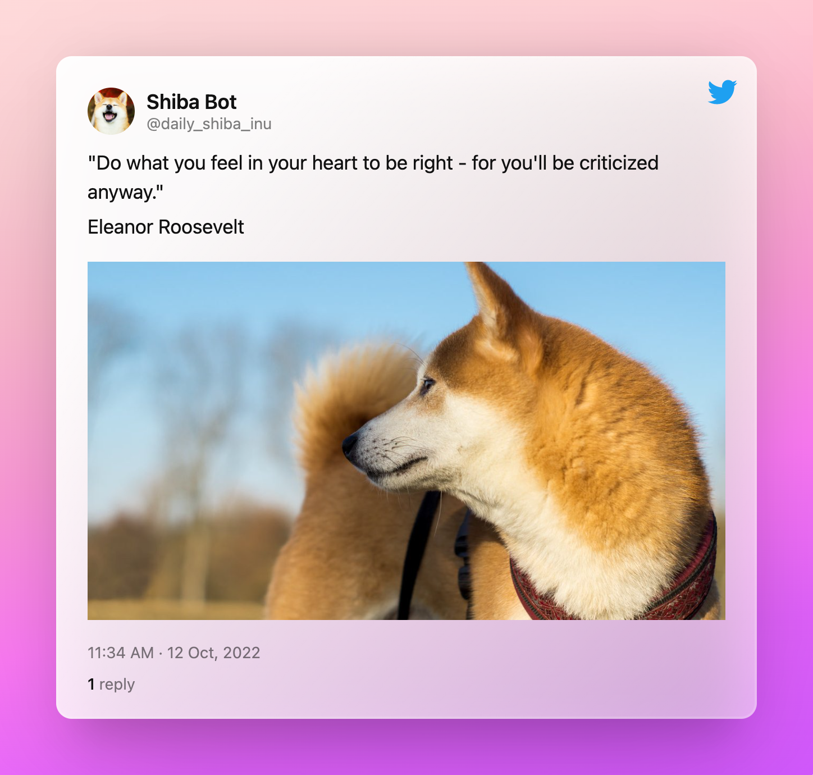
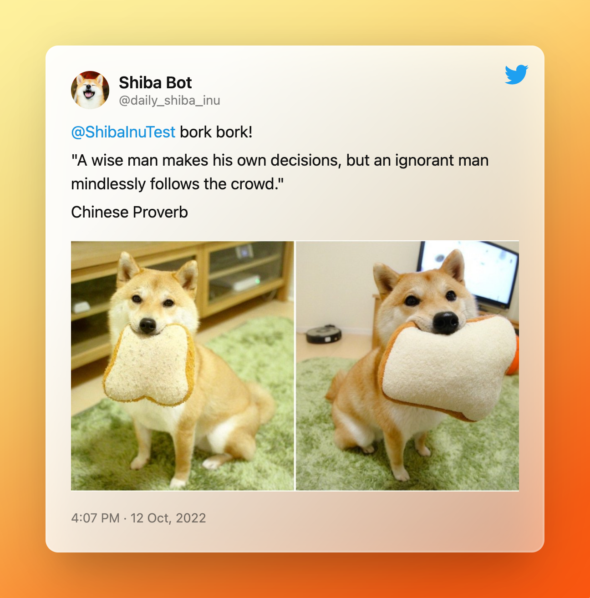

<h1 align= "center">
 Inspirational Shiba Inu Twitter Bot
</h1>


<p align="center">

</p>

<p align="center">

Tweet <a href="https://twitter.com/daily_shiba_inu" target="_blank">@daily_shiba_inu</a>
for an inspirational quote!
</p>

<p>
 This bot was created with love and as a way to get back into Python coding. I've always been interested in automation and figured this was a great way to learn more about automation with Python. 
 </p>
 
 <p>The bot is a Flask application hosted on AWS. Currently, the bot tweets an inspirational quote from the <a href="https://zenquotes.io/api" target="_blank">Zen Quotes API</a> alongside a random Shiba Inu image from the <a href="http://shibe.online/" target="_blank">Shibe API</a>. The Twitter API is then used to upload and post the image. 
</p>

<p>
The bot also checks for mentions every 5 minutes and will respond to them with some wisdom!
</p>

<h2 align= "center">
 Creating Your Own Bot 
</h2>


If you wish to use this project as a template for creating your own bot, do the following.

## Prerequisites

* Create a developer account with Twitter
* Request elevated access to be able to use the API v2 (necessary to upload images)
* Save your keys in a .env or somewhere safe.
* Create an account with AWS or your hosting service of choice

## Installation

```bash
# Clone the repo
$ git clone https://github.com/sarahdepalo/twitter-bot.git

# Change into the directory
$ cd twitterbot

# Install dependencies
$ pip install -r requirements.txt

# Swap out your credentials in constants.py
# Publish a post
$ python3 daily_post.py
```

🌸 Happy coding! 🌸

<p align="left">

</p>
